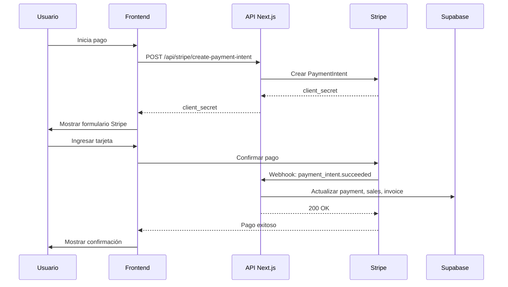

# 🚀 Guía Completa de Integración de Stripe - GO Admin ERP

Esta es la guía definitiva paso a paso para integrar Stripe en GO Admin ERP con soporte completo para pagos en el POS y módulos de finanzas.

## 📋 Tabla de Contenidos

1. [Requisitos Previos](#requisitos-previos)
2. [Configuración Inicial](#configuración-inicial)
3. [Estructura de Archivos](#estructura-de-archivos)
4. [Instalación de Dependencias](#instalación-de-dependencias)
5. [Implementación Backend](#implementación-backend)
6. [Implementación Frontend](#implementación-frontend)
7. [Testing](#testing)
8. [Producción](#producción)
9. [Resolución de Problemas](#resolución-de-problemas)

---

## 📦 Requisitos Previos

### ✅ Completado:
- [x] Cuenta de Stripe creada
- [x] Credenciales de Stripe configuradas
- [x] Webhook de Stripe configurado
- [x] Variables de entorno en Vercel
- [x] Variables de entorno en `.env.local`

### 📝 Credenciales:
```bash
NEXT_PUBLIC_STRIPE_PUBLISHABLE_KEY=pk_live_YOUR_KEY_HERE
STRIPE_SECRET_KEY=sk_live_YOUR_SECRET_KEY_HERE
STRIPE_WEBHOOK_SECRET=whsec_YOUR_WEBHOOK_SECRET_HERE
```

---

## 🔧 Configuración Inicial

### 1. Verificar Variables de Entorno

Las siguientes variables **ya están configuradas** en tu `.env.local` y Vercel:

```bash
# Stripe - Cliente (Frontend)
NEXT_PUBLIC_STRIPE_PUBLISHABLE_KEY=pk_live_YOUR_PUBLISHABLE_KEY

# Stripe - Servidor (Backend)
STRIPE_SECRET_KEY=sk_live_YOUR_SECRET_KEY

# Stripe - Webhook
STRIPE_WEBHOOK_SECRET=whsec_YOUR_WEBHOOK_SECRET
```

### 2. URL del Webhook en Stripe

Tu webhook debe apuntar a:
```
https://app.goadmin.io/api/webhooks/stripe
```

**Eventos a suscribir:**
- `payment_intent.succeeded`
- `payment_intent.payment_failed`
- `charge.succeeded`
- `charge.failed`
- `charge.refunded`

---

## 📁 Estructura de Archivos

Todos los archivos que se crearán:

```
go-admin-erp/
├── src/
│   ├── lib/
│   │   └── stripe/
│   │       ├── config.ts                 # ✅ Ya existe (mejoraremos)
│   │       ├── server.ts                 # Nuevo - Cliente servidor
│   │       ├── types.ts                  # Nuevo - Tipos TypeScript
│   │       └── paymentService.ts         # Nuevo - Servicio de pagos
│   │
│   ├── hooks/
│   │   └── useStripePayment.ts           # Nuevo - Hook React
│   │
│   ├── components/
│   │   └── stripe/
│   │       ├── StripeCheckout.tsx        # Nuevo - Componente checkout
│   │       └── PaymentStatus.tsx         # Nuevo - Estado de pago
│   │
│   └── app/
│       └── api/
│           └── stripe/
│               ├── create-payment-intent/
│               │   └── route.ts          # Nuevo - API crear pago
│               └── webhook/
│                   └── route.ts          # Nuevo - API webhook
│
├── docs/
│   ├── STRIPE_INTEGRATION_COMPLETE.md    # Este archivo
│   ├── STRIPE_TESTING.md                 # Nuevo - Guía de testing
│   └── STRIPE_TROUBLESHOOTING.md         # Nuevo - Problemas comunes
│
└── .env.local                            # ✅ Ya configurado
```

---

## 📦 Instalación de Dependencias

### Dependencias Necesarias:

```bash
npm install stripe @stripe/stripe-js @stripe/react-stripe-js
```

**Ya instaladas:**
- ✅ `@stripe/stripe-js` - Cliente de Stripe para frontend
- 🔄 `stripe` - SDK de Stripe para backend (verificar versión)
- 🔄 `@stripe/react-stripe-js` - Componentes React (instalar)

### Verificar e Instalar:

```bash
# Verificar versiones actuales
npm list stripe @stripe/stripe-js @stripe/react-stripe-js

# Instalar/actualizar si es necesario
npm install --save stripe@latest @stripe/stripe-js@latest @stripe/react-stripe-js@latest
```

---

## 🔨 Implementación Backend

### Paso 1: Actualizar Configuración de Stripe

**Archivo:** `src/lib/stripe/config.ts`

Este archivo será actualizado para seguir mejores prácticas.

### Paso 2: Crear Cliente del Servidor

**Archivo:** `src/lib/stripe/server.ts`

Cliente de Stripe para operaciones del lado del servidor.

### Paso 3: Crear Tipos TypeScript

**Archivo:** `src/lib/stripe/types.ts`

Definiciones de tipos para toda la integración.

### Paso 4: Crear Servicio de Pagos

**Archivo:** `src/lib/stripe/paymentService.ts`

Lógica de negocio para procesar pagos.

### Paso 5: Crear API de Payment Intent

**Archivo:** `src/app/api/stripe/create-payment-intent/route.ts`

Endpoint para crear intenciones de pago.

### Paso 6: Crear API de Webhook

**Archivo:** `src/app/api/stripe/webhook/route.ts`

Endpoint para recibir eventos de Stripe.

---

## 🎨 Implementación Frontend

### Paso 7: Crear Hook de React

**Archivo:** `src/hooks/useStripePayment.ts`

Hook personalizado para manejar pagos.

### Paso 8: Crear Componente de Checkout

**Archivo:** `src/components/stripe/StripeCheckout.tsx`

Componente reutilizable para checkout.

### Paso 9: Crear Componente de Estado

**Archivo:** `src/components/stripe/PaymentStatus.tsx`

Mostrar el estado de pagos.

---

## 🧪 Testing

### Modo de Prueba (Test Mode)

Para testing, usa estas credenciales de prueba en `.env.local`:

```bash
# Stripe Test Mode
NEXT_PUBLIC_STRIPE_PUBLISHABLE_KEY=pk_test_...
STRIPE_SECRET_KEY=sk_test_...
```

### Tarjetas de Prueba de Stripe:

| Escenario | Número de Tarjeta | CVC | Fecha |
|-----------|-------------------|-----|-------|
| ✅ Pago exitoso | 4242 4242 4242 4242 | Any | Futura |
| ❌ Pago rechazado | 4000 0000 0000 0002 | Any | Futura |
| 🔐 Requiere autenticación | 4000 0025 0000 3155 | Any | Futura |
| 💳 Insuficientes fondos | 4000 0000 0000 9995 | Any | Futura |

Ver: [docs/STRIPE_TESTING.md](./STRIPE_TESTING.md) para más detalles.

---

## 🚀 Producción

### Checklist Antes de Desplegar:

- [x] ✅ Variables de entorno en Vercel configuradas
- [x] ✅ Webhook URL configurada: `https://app.goadmin.io/api/webhooks/stripe`
- [ ] 🔄 Verificar firma de webhook en producción
- [ ] 🔄 Logging de errores configurado
- [ ] 🔄 Monitoreo de transacciones
- [ ] 🔄 Políticas de reintentos configuradas

### Variables de Entorno en Vercel:

1. Ir a: https://vercel.com/tu-proyecto/settings/environment-variables
2. Verificar:
   ```
   NEXT_PUBLIC_STRIPE_PUBLISHABLE_KEY = pk_live_...
   STRIPE_SECRET_KEY = sk_live_...
   STRIPE_WEBHOOK_SECRET = whsec_...
   ```

---

## 🔗 Integración con POS

### En CheckoutDialog.tsx:

```typescript
import { StripeCheckout } from '@/components/stripe/StripeCheckout'

// Agregar opción de pago con tarjeta
{metodo.code === 'card' && (
  <StripeCheckout
    amount={cart.total}
    currency={selectedCurrency}
    onSuccess={handleStripeSuccess}
    onError={handleStripeError}
  />
)}
```

---

## 🔗 Integración con Finanzas

### En Cuentas por Cobrar:

```typescript
// Aplicar abono con Stripe
await stripePaymentService.processPayment({
  amount: abonoAmount,
  accountId: cuentaId,
  customerId: customer.id
})
```

---

## 📊 Flujo Completo de Pago



---

## 🛠️ Resolución de Problemas

### Error: "No publishable key"
```typescript
// Verificar que la variable esté configurada
console.log(process.env.NEXT_PUBLIC_STRIPE_PUBLISHABLE_KEY)
```

### Error: "Webhook signature verification failed"
```typescript
// Verificar que STRIPE_WEBHOOK_SECRET esté correcto
// Regenerar webhook secret en Stripe Dashboard si es necesario
```

### Error: "Payment failed"
```typescript
// Revisar logs en Stripe Dashboard > Developers > Logs
// Verificar que la tarjeta sea válida
// Verificar que el monto sea correcto (en centavos)
```

---

## 📚 Recursos Adicionales

- [Documentación de Stripe](https://stripe.com/docs)
- [Stripe Dashboard](https://dashboard.stripe.com)
- [Stripe API Reference](https://stripe.com/docs/api)
- [Stripe Testing Guide](https://stripe.com/docs/testing)

---

## ✅ Estado de Implementación

- [x] Variables de entorno configuradas
- [x] Webhook configurado
- [ ] Backend implementado
- [ ] Frontend implementado
- [ ] Testing completado
- [ ] Despliegue a producción

---

## 🤝 Soporte

Para problemas específicos de Stripe:
1. Revisar [STRIPE_TROUBLESHOOTING.md](./STRIPE_TROUBLESHOOTING.md)
2. Logs en Stripe Dashboard
3. Logs de Vercel
4. Documentación oficial de Stripe
