# 💳 Ejemplo de Integración: Stripe en POS

Guía paso a paso para integrar Stripe en el módulo POS de GO Admin ERP.

---

## 📋 Objetivo

Agregar opción de pago con tarjeta usando Stripe en el CheckoutDialog del POS.

---

## 🎯 Resultado Final

El usuario podrá:
1. Seleccionar "Tarjeta" como método de pago
2. Ver formulario seguro de Stripe
3. Ingresar datos de tarjeta
4. Procesar pago en tiempo real
5. Ver confirmación inmediata

---

## 📝 Paso 1: Actualizar CheckoutDialog.tsx

### Agregar imports necesarios

```typescript
import { StripeCheckout } from '@/components/stripe/StripeCheckout'
import { useState } from 'react'
```

### Agregar estado para Stripe

```typescript
const [showStripeCheckout, setShowStripeCheckout] = useState(false)
const [stripePaymentData, setStripePaymentData] = useState<{
  amount: number
  currency: string
  description: string
} | null>(null)
```

### Detectar método de pago "card"

```typescript
// En el manejador de método de pago
const handlePaymentMethodChange = (methodCode: string) => {
  setSelectedPaymentMethod(methodCode)
  
  // Si es tarjeta, preparar datos de Stripe
  if (methodCode === 'card') {
    setStripePaymentData({
      amount: calculatedTotals.finalTotal,
      currency: selectedCurrency,
      description: `Venta POS - ${cart.items.length} items`,
    })
    setShowStripeCheckout(true)
  }
}
```

### Agregar componente de Stripe al UI

```typescript
{/* Después del selector de método de pago */}
{selectedPaymentMethod === 'card' && showStripeCheckout && stripePaymentData && (
  <div className="mt-4">
    <StripeCheckout
      amount={stripePaymentData.amount}
      currency={stripePaymentData.currency}
      description={stripePaymentData.description}
      organizationId={organizationId}
      branchId={branchId}
      customerId={cart.customer?.id}
      metadata={{
        cartId: cart.id,
        source: 'pos',
      }}
      onSuccess={handleStripeSuccess}
      onError={handleStripeError}
      onCancel={handleStripeCancel}
      isDarkMode={theme === 'dark'}
    />
  </div>
)}
```

---

## 📝 Paso 2: Implementar Handlers

### Handler de éxito

```typescript
const handleStripeSuccess = async (paymentIntentId: string) => {
  console.log('✅ Pago con Stripe exitoso:', paymentIntentId)

  try {
    // El pago ya fue procesado por el webhook de Stripe
    // Solo necesitamos completar el checkout en el POS
    
    await handleCheckout({
      cart,
      customerId: cart.customer?.id,
      paymentMethod: 'card',
      paymentReference: paymentIntentId,
      totalPaid: stripePaymentData!.amount,
      currency: stripePaymentData!.currency,
      notes: `Pago procesado con Stripe - PI: ${paymentIntentId}`,
    })

    toast.success('¡Pago procesado exitosamente!')
    
    // Cerrar modales
    setShowStripeCheckout(false)
    onClose()
    
  } catch (error: any) {
    console.error('❌ Error completando checkout:', error)
    toast.error('Error completando la venta')
  }
}
```

### Handler de error

```typescript
const handleStripeError = (error: string) => {
  console.error('❌ Error en pago con Stripe:', error)
  toast.error(`Error procesando el pago: ${error}`)
  
  // Permitir que el usuario intente de nuevo o cambie de método
  setShowStripeCheckout(false)
}
```

### Handler de cancelación

```typescript
const handleStripeCancel = () => {
  console.log('ℹ️ Usuario canceló el pago con Stripe')
  setShowStripeCheckout(false)
  setSelectedPaymentMethod(null)
  toast.info('Pago cancelado')
}
```

---

## 📝 Paso 3: Actualizar POSService

### Método checkout actualizado

```typescript
async checkout(checkoutData: {
  cart: Cart
  customerId?: string
  paymentMethod: string
  paymentReference?: string // ← Nuevo: Payment Intent ID de Stripe
  totalPaid: number
  currency: string
  notes?: string
}): Promise<{ sale: Sale; invoice: Invoice }> {
  
  // ... lógica existente ...
  
  // Crear venta
  const saleData = {
    organization_id: this.organizationId,
    branch_id: cart.branch_id,
    customer_id: checkoutData.customerId,
    user_id: await this.getCurrentUserId(),
    subtotal: cart.subtotal,
    tax_total: cart.tax_total,
    total: cart.total,
    balance: Math.max(0, cart.total - checkoutData.totalPaid),
    status: checkoutData.totalPaid >= cart.total ? 'paid' : 'partial',
    payment_status: checkoutData.totalPaid >= cart.total ? 'paid' : 'partial',
    payment_method: checkoutData.paymentMethod,
    notes: checkoutData.notes,
  }
  
  // ... crear sale ...
  
  // Crear factura
  const invoiceData = {
    organization_id: this.organizationId,
    branch_id: cart.branch_id,
    customer_id: checkoutData.customerId,
    sale_id: sale.id,
    number: await this.generateInvoiceNumber(),
    issue_date: new Date().toISOString(),
    due_date: new Date().toISOString(),
    currency: checkoutData.currency,
    subtotal: cart.subtotal,
    tax_total: cart.tax_total,
    total: cart.total,
    balance: Math.max(0, cart.total - checkoutData.totalPaid),
    status: checkoutData.totalPaid >= cart.total ? 'paid' : 'partial',
    payment_method: checkoutData.paymentMethod,
    tax_included: cart.tax_included,
    document_type: 'invoice',
    created_by: await this.getCurrentUserId(),
  }
  
  // ... crear invoice ...
  
  // Registrar pago
  // IMPORTANTE: Para pagos con Stripe, el webhook ya creó el payment
  // Solo verificamos que no se duplique
  
  if (checkoutData.paymentMethod !== 'card') {
    // Crear payment solo si NO es Stripe
    const paymentData = {
      organization_id: this.organizationId,
      branch_id: cart.branch_id,
      amount: checkoutData.totalPaid,
      payment_method: checkoutData.paymentMethod,
      source: 'invoice_sales',
      source_id: invoice.id,
      reference: checkoutData.paymentReference,
      status: 'completed',
      created_by: await this.getCurrentUserId(),
    }
    
    await supabase.from('payments').insert(paymentData)
  }
  // Si es Stripe, el webhook ya creó el payment
  
  // ... resto de la lógica ...
  
  return { sale, invoice }
}
```

---

## 📝 Paso 4: Configurar Método de Pago "card"

### En organization_payment_methods

Asegurarte de que existe el método "card" en la organización:

```sql
-- Verificar
SELECT * FROM organization_payment_methods 
WHERE organization_id = 2 
AND payment_method_code = 'card';

-- Si no existe, agregarlo
INSERT INTO organization_payment_methods (
  organization_id,
  payment_method_code,
  is_active,
  requires_reference,
  settings
) VALUES (
  2, -- Tu organization_id
  'card',
  true,
  false,
  '{"processor": "stripe"}'::jsonb
);
```

---

## 📝 Paso 5: Testing

### Flujo de Testing

1. **Agregar productos al carrito:**
   ```
   - Producto 1: $50
   - Producto 2: $30
   - Total: $80
   ```

2. **Ir a Checkout**

3. **Seleccionar método de pago "Tarjeta"**

4. **Verificar que aparezca el componente de Stripe**

5. **Ingresar tarjeta de prueba:**
   ```
   Número: 4242 4242 4242 4242
   Fecha: 12/25
   CVC: 123
   ZIP: 12345
   ```

6. **Clic en "Pagar"**

7. **Verificar éxito:**
   - ✅ Toast de éxito
   - ✅ Venta creada con `status: 'paid'`
   - ✅ Factura creada
   - ✅ Payment registrado con referencia de Stripe
   - ✅ Carrito limpiado
   - ✅ Inventario actualizado

### Verificar en Base de Datos

```sql
-- Venta
SELECT * FROM sales 
WHERE payment_method = 'card' 
ORDER BY created_at DESC 
LIMIT 1;

-- Factura
SELECT * FROM invoice_sales 
WHERE payment_method = 'card' 
ORDER BY created_at DESC 
LIMIT 1;

-- Pago (creado por webhook)
SELECT * FROM payments 
WHERE reference LIKE 'pi_%' 
ORDER BY created_at DESC 
LIMIT 1;
```

### Verificar en Stripe Dashboard

1. Ir a: https://dashboard.stripe.com/test/payments
2. Buscar el Payment Intent
3. Verificar que el status sea "Succeeded"
4. Verificar metadata:
   ```json
   {
     "organizationId": "2",
     "branchId": "1",
     "customerId": "...",
     "source": "pos"
   }
   ```

---

## 🎨 Personalización Avanzada

### Cambiar apariencia del formulario

En `CheckoutDialog.tsx`:

```typescript
<StripeCheckout
  // ... props existentes ...
  isDarkMode={theme === 'dark'}
/>
```

El componente automáticamente usa los temas configurados en `config.ts`.

### Agregar validación de monto mínimo

```typescript
const MIN_STRIPE_AMOUNT = 0.5 // USD

const handlePaymentMethodChange = (methodCode: string) => {
  if (methodCode === 'card') {
    // Validar monto mínimo
    if (calculatedTotals.finalTotal < MIN_STRIPE_AMOUNT) {
      toast.error(`El monto mínimo para pagos con tarjeta es $${MIN_STRIPE_AMOUNT}`)
      return
    }
    
    // Continuar con Stripe...
  }
}
```

### Agregar fee de procesamiento

```typescript
const STRIPE_FEE_PERCENTAGE = 0.029 // 2.9%
const STRIPE_FEE_FIXED = 0.30 // $0.30

const calculateStripeFee = (amount: number) => {
  return (amount * STRIPE_FEE_PERCENTAGE) + STRIPE_FEE_FIXED
}

// Mostrar al usuario
const stripeFee = calculateStripeFee(calculatedTotals.finalTotal)
const totalWithFee = calculatedTotals.finalTotal + stripeFee
```

---

## 🔄 Flujo Completo

```mermaid
sequenceDiagram
    participant U as Usuario
    participant POS as POS CheckoutDialog
    participant SC as StripeCheckout
    participant API as API Next.js
    participant S as Stripe
    participant WH as Webhook
    participant DB as Supabase

    U->>POS: Selecciona método "Tarjeta"
    POS->>SC: Muestra componente Stripe
    SC->>API: POST /create-payment-intent
    API->>S: Crear PaymentIntent
    S-->>API: client_secret
    API-->>SC: client_secret
    SC->>U: Muestra formulario
    U->>SC: Ingresa datos tarjeta
    SC->>S: Confirmar pago
    S->>WH: payment_intent.succeeded
    WH->>DB: Guardar payment
    S-->>SC: Pago exitoso
    SC->>POS: onSuccess(paymentIntentId)
    POS->>DB: Crear sale + invoice
    POS->>U: Confirmación
```



---

## ✅ Checklist de Implementación

- [ ] Imports agregados a CheckoutDialog
- [ ] Estado de Stripe agregado
- [ ] Handlers implementados (success, error, cancel)
- [ ] StripeCheckout agregado al UI
- [ ] POSService.checkout actualizado
- [ ] Método "card" agregado a organization_payment_methods
- [ ] Testing con tarjeta de prueba exitoso
- [ ] Verificado en BD: sale, invoice, payment
- [ ] Verificado en Stripe Dashboard
- [ ] Manejo de errores funcionando
- [ ] UI responsive y con tema correcto

---

## 📚 Recursos Adicionales

- [STRIPE_INTEGRATION_COMPLETE.md](./STRIPE_INTEGRATION_COMPLETE.md)
- [STRIPE_TESTING.md](./STRIPE_TESTING.md)
- [STRIPE_TROUBLESHOOTING.md](./STRIPE_TROUBLESHOOTING.md)
- [Stripe Docs](https://stripe.com/docs)
