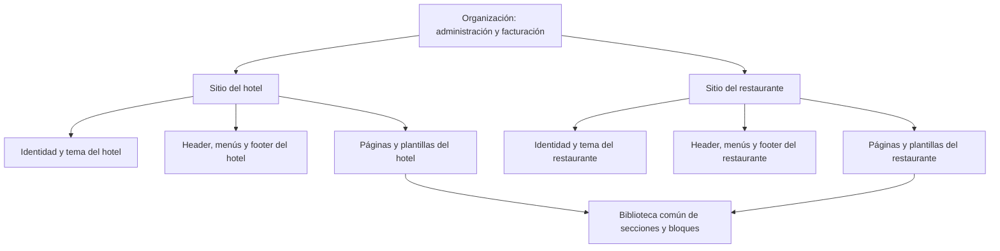

# Análisis de branding, editor y sitios por negocio

> Nota 2026-09-21: los hallazgos 1–12 tienen destino en [ADR-002](../website-builder-v2/ADR-002-DECISIONES-Y-SECUENCIA.md) (D1, D3, D4, D6, D7, D10) y en las etapas 1–2 del [plan V2](../website-builder-v2/PLAN-MAESTRO.md).

Fecha de revisión: 2026-09-19. Proyectos: `go-admin-erp` y `goadmin-websites`.

Continuación: [plan maestro del editor visual V2 y sus fases de implementación](../website-builder-v2/PLAN-MAESTRO.md), con biblioteca de composiciones y trazabilidad de las 32 referencias. Este diagnóstico conserva la evidencia del estado previo.

## Conclusión

La base existente permite evolucionar hacia un hotel y varios restaurantes con diseños independientes. Sin embargo, el flujo completo todavía no garantiza esa independencia. Hay infraestructura de outlets, pero persisten bloqueos de base de datos, identidad compartida, navegación que pierde el contexto y diferencias entre portada, páginas de detalle y vista previa.

La prioridad es completar una experiencia coherente por negocio. Después conviene ampliar las composiciones visuales de la biblioteca, aprovechando lo existente. No hace falta reconstruir todo el editor.

Este documento distingue evidencia del código local, evidencia de la base real y propuestas. No se modificaron datos ni código de aplicación. No se realizó una prueba visual de un hotel/restaurante publicado en estos proyectos: en la base consultada no hay outlets publicados. Las 32 referencias del usuario se contrastaron en el [análisis visual complementario](REFERENCIAS-DISENO-2026-09-19.md), que declara la cobertura de navegación, capturas y muestra móvil.

## Qué se revisó

- Entrada de branding, ruta antigua de redirección y editor actual.
- Servicios de configuración, páginas, secciones, menús, borradores, versiones y presets.
- Selector de outlet, creación de páginas, guardado, cambio de contexto y vista previa.
- Resolución de organización/outlet por host y ruta en el sitio público.
- Configuración efectiva, navegación, headers, footers y estilos globales.
- Renderizador, catálogo, manifiesto y componentes representativos de hotel y restaurante.
- Portada, rutas de producto, categoría y habitación; metadatos y enlaces.
- Esquema e índices reales mediante MCP de Supabase. Las consultas de datos fueron agregadas y no recuperaron nombres de clientes.

## Estado real y piezas aprovechables

| Capa | Evidencia | Lectura práctica |
|---|---|---|
| Configuración | 84 filas en `website_settings`; 0 con `branch_id` | Todas las configuraciones siguen siendo globales |
| Páginas | 1.064 filas; 0 con `branch_id` | No hay páginas propias de outlets en los datos consultados |
| Secciones | 1.944 filas; 0 con `branch_id` | Todo el contenido sigue asociado al ámbito global |
| Uso del catálogo | 37 tipos y 57 combinaciones tipo/variante almacenadas | La migración debe conservar los diseños existentes, incluidos alias históricos |
| Sucursales | 89; ninguna con `is_web_published=true` | No hay un caso publicado para validar la independencia completa |
| Tipos de sucursal | 87 nulos, 1 vacío, 1 `main` | Todavía falta configurar los tipos de negocio publicables |
| Catálogo ERP | 65 tipos y 116 combinaciones tipo/variante | Ya hay amplitud funcional |
| Renderizador público | 65 tipos y 119 combinaciones | Todas las combinaciones del editor tienen entrada en el renderizador local |

El conteo del catálogo se hizo leyendo los AST de TypeScript de `RAW_CATALOG` y `SECTION_MAP`. Que una combinación esté registrada no demuestra que todos sus campos funcionen ni que su diseño sea distinto. Los tres alias del renderer no ofrecidos por el editor se usan en 50 secciones guardadas de `categories_grid`: `grid` (25), `horizontal` (24) e `icons` (1). Su compatibilidad no debe eliminarse al unificar el contrato.

Ya existen secciones universales, filtros por tipo de negocio, composición ordenada, duplicación, copia de estilos, presets de sección, historial local, un manifiesto de compatibilidad y vista previa mediante iframe. También hay variantes de header de escritorio y móvil, y opciones de footer. Son piezas que conviene conservar.

La ruta `/app/organizacion/branding/editor/[pageId]` redirige a `/organizacion/branding/editor/[pageId]`; no son dos editores independientes.

## Hallazgos prioritarios

### 1. La base todavía impide la configuración independiente

**Confirmado en la base real.** Conviven índices nuevos por organización/sucursal con los UNIQUE antiguos:

- `website_settings_organization_id_key`: único por `organization_id`.
- `website_pages_organization_id_slug_key`: único por `organization_id, slug`.

El primero impide guardar una configuración del restaurante si la organización ya tiene una global. El segundo impide que ambos tengan su propia página `home`, `contacto` o `nosotros`.

El plan existente documenta que quitar estas restricciones antes de adaptar las lecturas cambió la forma de las relaciones anidadas de PostgREST. Por tanto, no corresponde eliminarlas aisladamente: primero hay que revisar los consumidores, desplegar lecturas compatibles y preparar una migración con reversión. No se aplicó ninguna migración en esta revisión.

Evidencia: índices consultados por MCP; [plan anterior](PLAN.md); `goadmin-websites/lib/outlet/theme-merge.ts`.

### 2. El negocio tiene campos de identidad que el sitio no utiliza

`branches` tiene `website_logo_url`, `website_cover_url`, nombre, contacto y ubicación. Sin embargo, `ResolvedOutlet` no transporta el logo ni el contacto y `getOrgContext` solo reemplaza `organization.website_settings`.

El logo del header y del footer sigue leyendo `organization.logo_url`; el nombre y varios datos de contacto siguen leyendo la organización. Cambiar colores no basta para convertir al restaurante en una marca propia.

Se necesita una identidad pública efectiva del negocio, separada de la identidad legal usada para facturar: nombre comercial, logos claro/oscuro, favicon, contacto, dirección, horarios y redes. La relación con la organización se conserva.

Evidencia: `goadmin-websites/lib/outlet/resolver.ts:7`, `lib/get-org-context.ts:140`, `components/site/header/HeaderShared.tsx:207` y `components/site/SiteFooter.tsx:302`.

### 3. El footer y la navegación no tienen un alcance uniforme

Los menús nombrados pertenecen a la organización; las tablas no tienen `branch_id`. El header puede seleccionar un menú por ID en settings, pero el footer carga todos los menús de la organización ubicados en `footer` o `both`.

Además, `getOrgContext` representa el sitio global con `branchId=undefined`. Las consultas de navegación interpretan `undefined` como «sin filtro de sucursal», mientras que `null` significa «solo global». Cuando se creen páginas de outlets, la navegación global podrá incluirlas sin una selección explícita.

Las consultas del outlet suman páginas globales y propias, sin resolver por slug cuál prevalece. Al permitir slugs repetidos, pueden aparecer enlaces duplicados.

Hace falta una regla común: sitio efectivo, menú asignado por ubicación y reemplazo explícito de páginas heredadas. Compartir un menú debe ser una elección visible.

Evidencia: `goadmin-websites/lib/get-org-context.ts:71,109`, `lib/supabase/queries.ts:1402,1438,2684`; esquema real de `website_menus` y `website_menu_items`.

### 4. Los enlaces por ruta pueden sacar al visitante del restaurante

La portada resuelve `/restaurante/menu`, pero muchos enlaces se construyen como `/`, `/menu`, `/productos/...` o `/categorias/...`. En un outlet publicado bajo un prefijo, esos enlaces vuelven al ámbito global.

También hay una limitación de enrutamiento: el catch-all consume el prefijo del outlet y utiliza únicamente el primer segmento restante como slug. `/restaurante/productos/id` no entra automáticamente a la ruta de detalle `/productos/[id]`.

Los canonical y Open Graph de la portada usan el dominio de la organización y omiten el prefijo del outlet. La identidad en buscadores y al compartir enlaces puede quedar asociada a la página global.

Propuesta: un constructor único de URLs internas y una resolución común de contexto para portada, detalles, formularios, APIs y metadatos. Elegir y verificar al menos una estrategia completa de publicación antes de anunciar soporte equivalente para prefijo, subdominio y dominio propio.

Evidencia: `goadmin-websites/app/[[...slug]]/page.tsx:57,76,131`, `components/site/SiteHeader.tsx:360`, `components/site/SiteFooter.tsx:48`, `components/sections/restaurant/MenuPreviewTabs.tsx:69`.

### 5. Las páginas secundarias no conservan toda la configuración de la portada

`getWebsitePageByType` filtra por organización y tipo, sin sucursal, y termina en `.single()`. Dos plantillas de detalle del mismo tipo en outlets distintos no se resuelven correctamente.

Producto y categoría pasan al layout menos información que la portada: omiten los árboles completos de navegación y los menús nombrados del footer. Esto puede cambiar header/footer al entrar a un detalle, incluso si los colores efectivos llegan correctamente.

La página de habitación sigue una composición fija y no consume una plantilla `space_detail` del constructor. Tener ese tipo disponible en el editor no equivale a que la habitación pública sea completamente editable.

Propuesta: una envoltura común del sitio y una matriz explícita de páginas editables: portada, páginas editoriales, listados, detalles y flujos operativos.

Evidencia: `goadmin-websites/lib/supabase/queries.ts:1368`; `app/productos/[id]/page.tsx:206,273`; `app/categorias/[slug]/page.tsx:78,99`; `app/espacios/[id]/page.tsx`.

### 6. La creación y edición por outlet no están conectadas de extremo a extremo

`BrandingPagesTab` acepta `branchId`, pero su único uso encontrado en la interfaz de branding no lo pasa. Desde esa entrada se crean páginas globales. El selector de outlet está dentro del editor, no en todo el centro de branding.

El selector solo ofrece sucursales ya publicadas. Esto dificulta el flujo natural «crear negocio → preparar sitio en borrador → revisar → publicar».

Al cambiar de outlet, `setSelectedBranchId` se ejecuta antes de llamar a `doPageChange`, pero esa función conserva el valor del render anterior. Puede validar la página contra el outlet previo. Además, al cambiar de página/outlet no se vacían todos los pendientes de SEO, layout y menús; esos pendientes sí se guardan posteriormente.

Las páginas globales heredadas son editables y existe una advertencia de que afectan a todos. Para personalizar solo un restaurante hace falta una acción clara de «crear versión propia», con copia de la página y sus secciones en el nuevo alcance.

Evidencia: [entrada de branding](../../src/app/app/organizacion/branding/page.tsx), [editor](../../src/app/organizacion/branding/editor/%5BpageId%5D/page.tsx), [servicio de páginas](../../src/lib/services/websitePageBuilderService.ts).

### 7. La vista previa no representa el sitio completo del outlet

La URL se obtiene por organización. `currentPreviewUrl` agrega la página, pero no utiliza el dominio/prefijo del outlet seleccionado. El iframe recibe secciones por `postMessage`; no recibe la configuración completa de marca, header, footer y navegación.

Resultado derivado del código: se pueden previsualizar las secciones de un restaurante dentro de la envoltura y los datos precargados del sitio global. Los cambios del header/footer requieren guardar/recargar para llegar al sitio.

El editor acepta eventos de selección de sección desde una lista fija de orígenes que no incluye los dominios ordinarios de los clientes. La selección desde el lienzo necesita validar contra el origen efectivo del iframe.

Propuesta: una vista previa que resuelva negocio, página, datos y revisión de borrador; el contenido y la envoltura deben usar la misma revisión.

Evidencia: `websitePageBuilderService.ts:3749`, editor `page.tsx:917`, [EditorPreview](../../src/components/organization/branding/editor/EditorPreview.tsx:39).

### 8. Guardar y publicar todavía no forman un flujo editorial seguro

Existen `saveDraft`, `publishPage` y versiones, pero el editor revisado guarda directamente en las secciones vivas. Agregar y eliminar también escriben inmediatamente. Esas acciones pueden cambiar una página publicada antes de una publicación deliberada.

`publishPage` realiza varias operaciones independientes: eliminar, actualizar/insertar secciones, crear versión y limpiar borrador. No es una publicación atómica. Sus snapshots contienen secciones, no un estado completo de identidad, header, footer y página.

Para rediseñar un hotel en funcionamiento se necesita guardar borrador, previsualizarlo y publicar de forma atómica. La restauración debe tener un alcance explícito. El historial local de secciones no reemplaza ese mecanismo.

Evidencia: editor `page.tsx:494,516,718`; `websitePageBuilderService.ts:3478,3496`.

### 9. La herencia visual se convierte en una copia al personalizar

El sitio tiene un merge que hereda los valores `null`/`undefined`. Pero al crear settings de outlet, el ERP copia prácticamente toda la fila global. Los campos no modificados quedan fijados con el valor de ese momento: ya no siguen futuros cambios del sitio padre.

También existen defaults de base de datos para muchos campos, de modo que «no lo configuré» no equivale necesariamente a «heredar». El merge de objetos es superficial.

Propuesta: distinguir heredar, sobrescribir y vaciar; guardar únicamente las diferencias de presentación. Mostrar en el editor el origen de cada valor y permitir «restablecer herencia». Separar las decisiones visuales de configuraciones operativas como pagos y entregas.

Evidencia: `websiteSettingsService.ts:389`; `goadmin-websites/lib/outlet/theme-merge.ts:31`.

### 10. Los controles de diseño necesitan un contrato completo con el sitio

El editor guarda `font_heading`, `font_body`, `background_color` y `text_color`. `OrganizationLayout` toma las fuentes del preset y fija fondos/textos claros u oscuros. En la búsqueda de consumidores no se encontró la aplicación de `--font-heading`/`--font-body` a la tipografía global; definir una variable no cambia por sí solo una fuente.

Componentes como habitaciones y menú fijan clases de color y tamaño propias. Por eso un control de texto/fondo en el contenedor no garantiza que todo el contenido interno adopte el estilo.

Propuesta: tokens efectivos de color, tipografía, escala, ancho, espacio, bordes y botones; una aplicación consistente en los componentes y carga real de fuentes. Las excepciones locales deben ser deliberadas.

Evidencia: [GlobalSettingsPanel](../../src/components/organization/branding/editor/GlobalSettingsPanel.tsx:120); `goadmin-websites/components/site/OrganizationLayout.tsx:111`; `components/sections/hotel/SpacesCards.tsx`; `components/sections/restaurant/MenuPreviewTabs.tsx`.

### 11. La variedad nominal supera a la variedad visual y funcional

El hotel tiene cuatro familias específicas: habitaciones, amenidades, CTA de reserva y razones para elegirlo. El restaurante tiene cinco: menú, especialidades, reserva, domicilio y chef. Pueden combinarse con las quince familias universales del filtro.

Hay variantes que apuntan al mismo componente sin leer `sectionVariant`. Por ejemplo, `booking_cta` usa `BookingCtaBanner` para sus tres variantes y decide su composición con `content.show_form`. Cambiar únicamente la variante no cambia esa composición. Algo similar ocurre con `reservation_cta` y con los alias de banners promocionales.

`MenuPreviewTabs` presenta listas por categoría; no implementa pestañas interactivas. El botón de búsqueda del formulario en `BookingCtaBanner` tiene `type="button"` y no tiene manejador. La variante visual de formulario todavía no conecta esa búsqueda a las reservas.

No debe medirse el avance solo por cantidad de variantes. Cada una debe tener composición diferenciada, controles funcionales, estados vacíos, versión móvil y enlaces/acciones conectados al negocio correcto.

Evidencia: `goadmin-websites/components/sections/SectionRenderer.tsx`; `components/sections/hotel/BookingCtaBanner.tsx:40`; `components/sections/restaurant/MenuPreviewTabs.tsx`.

### 12. Muchas secciones requieren fuentes de datos y guardado por instancia

El diálogo permite repetir tipos de sección: «ya existe» es un indicador, no una prohibición. Se pueden construir páginas largas con varias galerías, bloques de historia y CTA.

Pero el guardado recorre todas las secciones y copia galería, testimonios y FAQ a campos únicos de `website_settings`. Si hay varias del mismo tipo, la última reemplaza el valor agregado. Las secciones conservan su contenido individual, pero los consumidores de esos campos globales reciben solo esa última colección.

Los presets de sección guardan `content`, pero no el objeto `settings`. Parte del estilo vive en `content` y parte puede vivir en `settings`; una composición guardada no garantiza reproducir ambos.

Además, la portada precarga hasta 500 productos cuando encuentra determinadas familias. Al ampliar la biblioteca, las fuentes de datos deberían declarar qué necesitan y sus límites, compartir consultas y paginar colecciones. La cantidad de secciones no debe multiplicar cargas completas del catálogo.

Evidencia: `AddSectionDialog.tsx:227`; editor `page.tsx:842`; `websitePageBuilderService.ts:3715`; `goadmin-websites/app/[[...slug]]/page.tsx:172`.

## Arquitectura propuesta

Conviene separar tres conceptos en el producto: organización legal, negocio/sucursal operativa y sitio público. Para la primera entrega, el sitio puede seguir usando el alcance existente `(organization_id, branch_id)`; no es necesario introducir de inmediato otra entidad en la base. Si después una marca necesita varios sitios o un sitio agrupa varias sucursales, entonces sí tendría sentido un `site_id` explícito con sus relaciones.

Cada sitio debe tener una envoltura común para todas sus páginas. Una página puede cambiar explícitamente el comportamiento del header —por ejemplo, transparente sobre la portada y sólido en las demás— sin duplicar el sitio entero.

La cascada propuesta es: base del sistema → tema del sitio → ajustes de página → ajustes de sección/bloque. La herencia desde otro sitio es opcional y explícita. No se heredan automáticamente reglas de cobro, inventario o permisos por compartir un tema visual.

## Biblioteca de secciones que escale bien

Separar cinco niveles:

| Nivel | Función | Ejemplo |
|---|---|---|
| Tema | Identidad visual transversal | Tipografía editorial, crema/negro, botones discretos |
| Plantilla de sitio/página | Punto de partida completo | Hotel boutique; restaurante de autor |
| Sección | Unidad de contenido con propósito | Habitaciones, historia, carta, galería |
| Variante | Composición visual real | Hero dividido, imagen completa, collage |
| Bloque repetible | Elementos editables dentro de una sección | Tarjeta, plato, beneficio, enlace |

El modelo actual es principalmente una lista de secciones con campos. Para ampliar flexibilidad, conviene añadir bloques y ranuras controladas dentro de las secciones que lo necesiten, conservando las existentes mediante compatibilidad. Un constructor de anidamiento arbitrario sería más complejo de mantener y más fácil de romper en móvil.

Catálogo inicial sugerido, complementado por la [matriz de referencias](REFERENCIAS-DISENO-2026-09-19.md):

| Familia | Composiciones útiles |
|---|---|
| Hero | Editorial, pantalla completa, dividido, video, carrusel, portada con buscador |
| Contenido | Historia con imagen, columnas, texto amplio, manifiesto, cronología |
| Colecciones | Tarjetas, grilla asimétrica, carrusel, listado editorial |
| Galería | Mosaico, collage, carrusel, pantalla completa con lightbox |
| Hotel | Suites, experiencias, restaurantes del hotel, spa, eventos, ubicación, reserva |
| Restaurante | Carta con pestañas reales, carta editorial, platos destacados, chef, ambiente, eventos, reserva |
| Confianza | Reseñas, reconocimientos, cifras, aliados |
| Cierre | CTA, contacto, mapa, FAQ, newsletter |

Una sección «negocios del hotel» debería enlazar explícitamente a sitios relacionados, no mezclar los catálogos de las sucursales. La disponibilidad de secciones se debe basar en capacidades habilitadas, con recomendaciones por tipo de negocio; una lista rígida por `branch_type` puede impedir combinaciones válidas.

Cada definición debe incluir esquema validable y versionado, valores iniciales, variantes, controles por variante, compatibilidad con tipos de página, fuente de datos, límites de repetidores, comportamiento móvil y requisitos de accesibilidad. Los presets deben guardar contenido y estilo/configuración, con una distinción clara entre copiar una composición y vincular una sección compartida.

El registro común debe alimentar al editor y al renderer. Puede comenzar como un contrato versionado compartido entre los dos repositorios, con adaptadores de datos distintos. El manifiesto actual comprueba nombres y agrupa claves por tipo; no verifica por sí solo que cada variante lea sus campos ni que una acción funcione.

## Dos experiencias realmente diferentes

**Hotel:** logo centrado, navegación serena, hero de fotografía amplia, búsqueda de disponibilidad conectada, suites en composición editorial, experiencias, restaurantes del hotel, galería y footer con ubicación/contacto.

**Restaurante:** logo propio, header compacto con CTA de reserva, hero gastronómico, historia del chef, carta en pestañas o listado editorial, platos destacados, ambiente, horarios y footer con contacto/redes propios.

Los dos reutilizan el motor y los datos autorizados del ERP. Comparten organización legal, pero sus páginas no tienen que compartir paleta, fuentes, proporciones, header, footer, navegación ni tono visual. Estos ejemplos son una dirección de producto, no diseños aprobados.

## Experiencia del editor

El selector de sitio debe estar presente desde la entrada de branding y mantenerse al crear páginas, elegir tema, editar menús, revisar SEO, previsualizar y publicar. Debe admitir sitios en borrador.

El editor debería mostrar: sitio seleccionado, página actual, estado del borrador y alcance de la modificación. En el panel lateral: identidad/tema, header, páginas, secciones, footer y ajustes de página. Al agregar contenido: biblioteca visual con miniaturas reales, familias, variantes y presets guardados.

Las acciones sobre contenido heredado deben ofrecer «personalizar solo aquí» o «editar el original compartido». Cambiar de página debe descartar o conservar todos los pendientes de forma consistente. Guardar borrador nunca debe alterar el sitio publicado.

En móvil se deben verificar recorte de imágenes, orden de columnas, altura del hero, tamaño de títulos, navegación táctil y reservas. También teclado, foco, etiquetas, contraste y movimiento reducido. No se declaró conformidad de accesibilidad en esta revisión: requiere pruebas de interfaz.

## Orden recomendado de ejecución

| Etapa | Entrega verificable |
|---|---|
| 1. Fundamentos | Contexto único de sitio, alcance consistente, compatibilidad de consultas y eliminación controlada del bloqueo UNIQUE |
| 2. Identidad y envoltura | Logo/contacto/tema propios; header, footer y menús iguales al recorrer todas las páginas del mismo sitio |
| 3. Flujo editorial | Crear páginas por sitio, personalizar heredadas, borrador completo, preview fiel, publicación atómica y restauración |
| 4. Sistema visual | Tokens aplicados, variantes realmente diferentes, fuentes cargadas y controles que coinciden con el render |
| 5. Hotel y restaurante | Dos plantillas completas basadas en las referencias, con reservas/datos conectados |
| 6. Ampliación | Nuevas familias, bloques y presets, con contrato y verificación visual sostenibles |

El despliegue debe coordinar ambos repositorios y mantener las páginas globales existentes. Antes de habilitar outlets hay que verificar el comportamiento de cada lector tras cambiar la cardinalidad de settings. Las migraciones pertenecen al ERP y requieren su reversión versionada.

## Criterios de aceptación

1. Una organización puede tener hotel y dos restaurantes con `home` y `contacto` propios.
2. Cada sitio mantiene su identidad, header, footer y navegación al abrir portada, listado, detalle y reserva.
3. Cambiar el logo, la fuente o el footer de un restaurante no cambia otro sitio.
4. Los enlaces conservan el contexto y los canonical identifican la URL correcta.
5. Crear, eliminar, reordenar o cambiar una sección en borrador no altera lo publicado.
6. La vista previa muestra la revisión completa del sitio y los datos del outlet adecuado.
7. Publicar ocurre como una operación consistente; restaurar recupera el alcance anunciado.
8. Las fuentes, colores y controles expuestos tienen efecto verificable; las variantes son visualmente distintas.
9. Los formularios de reserva ejecutan su acción con sucursal correcta y estados de carga/error/éxito.
10. Un sitio global existente conserva apariencia, rutas y operaciones durante la transición.
11. Las secciones con datos reutilizan servicios y cargan cantidades acotadas; no multiplican consultas por tarjeta.
12. La versión móvil se verifica con teclado, tacto y distintos anchos, además del escritorio.

## Resultado del contraste visual

Las [32 referencias](REFERENCIAS-DISENO-2026-09-19.md) confirman que hacen falta decisiones de composición de página, además de secciones. Qitchen conserva un panel visual y otro de contenido en carta/reserva; MĒR organiza su página como un recibo; Hotellia conecta hotel, habitaciones y gastronomía dentro de una misma identidad. Para el objetivo solicitado, la relación hotel/restaurante debe permitir también identidades independientes.

La primera dirección propuesta es un hotel editorial y un restaurante de autor, con páginas internas completas. Después se incorpora una familia gráfica de cafetería/panadería y una carta compacta para QR. El documento complementario detalla familias de header/footer, controles de imagen/tipografía, capacidades existentes que requieren corrección y nuevas composiciones. No se eligió un diseño definitivo en nombre del usuario.

## Verificación de esta revisión

- Esquema, índices y conteos: consultas de lectura por MCP de Supabase.
- Catálogo contra renderizador local: comparación AST; 0 variantes ofrecidas sin entrada en el renderer y 3 variantes del renderer no ofrecidas (`categories_grid:grid`, `horizontal`, `icons`).
- Sitio público: `npm run typecheck` y `npx next build` finalizaron correctamente. Esto comprueba compilación, no el diseño en navegador.
- ERP, `npx jest --runInBand`: 353 suites aprobadas, 2 fallidas y 1 omitida; 6.642 pruebas aprobadas, 3 fallidas y 1 omitida. Dos fallos pertenecen al contrato de secciones ya señalado en las instrucciones del repositorio; el otro está en `orgBodyRoutes.f0sec.test.ts`, en el flujo del asistente. No se cambió ese código.
- El test de contrato usa `siteManifest.fixture.ts`. Su fallo no contradice la comparación directa de los dos registros locales: el fixture y el renderizador son fuentes diferentes y necesitan sincronización.
- ERP, `npx tsc --noEmit -p tsconfig.json`: 12 errores en archivos del asistente y sus pruebas, fuera de branding. Es el estado observado del árbol de trabajo, que ya contenía cambios ajenos; no se atribuye su origen a esta revisión.
- ERP, `npx next build`: finalizó correctamente. La configuración omite validación de tipos y lint durante el build, así que este resultado no reemplaza el fallo independiente de `tsc`. Se observaron advertencias de configuración/runtime ajenas al análisis de branding.
- No se ejecutó `verify:tracking`: su implementación accede a la base desde un script y las instrucciones de esta revisión exigen usar MCP para el acceso a la base. No se modificó tracking ni se afirma haberlo validado.
- No se modificaron datos, migraciones ni código funcional. No se hicieron commits, pushes ni despliegues.
