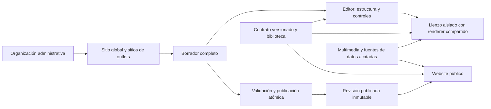

# Plan maestro — Editor visual y sitios independientes V2

Fecha: 2026-09-19. Revisado y re-secuenciado el 2026-09-21 por [ADR-002](ADR-002-DECISIONES-Y-SECUENCIA.md). Estado: **F00 cerrada con dos riesgos declarados; etapa 1 lista para iniciar; sin migraciones V2 aplicadas**. Estados y evidencia vigentes en [PROGRESS.md](../../PROGRESS.md).

## Resultado esperado

Cada organización conserva su sitio actual y puede rediseñarlo en borrador. Sus outlets pueden tener fondo, colores, tipografía, logos, header, footer, navegación, páginas, secciones, fotografías y videos propios. Compartir una organización administrativa no obliga a compartir apariencia. La edición se ve inmediatamente en un lienzo interactivo antes de publicar.

El alcance final incluye las familias de composición identificadas en las 32 referencias: hotel, restaurante, cafetería, panadería, carta QR, comercio y servicios. Las dos primeras plantillas sirven como piloto técnico y visual; **no reducen el alcance final a dos diseños**.

Fuentes: [diagnóstico verificado](../multi-outlet/ANALISIS-BRANDING-Y-SITIOS-2026-09-19.md), [comparación visual](../multi-outlet/REFERENCIAS-DISENO-2026-09-19.md) y código local de ambos proyectos. El plan anterior de `multi-outlet` se conserva como antecedente histórico. Sus instrucciones antiguas sobre migraciones no gobiernan este trabajo: manda la [política vigente](../POLITICA-MIGRACIONES.md).

## Decisiones de producto y arquitectura

1. **Compatibilidad primero y solo adiciones.** Conservar tablas, restricciones, filas y comportamiento legacy; V2 usa almacenamiento separado según [ADR-001](ADR-001-ADICIONES-SIN-ALTERAR-LEGACY.md). No sustituir automáticamente tema, contenido ni recursos de los sitios activos. La adopción V2 se activa por sitio y por revisión publicada.
2. **Un contexto de sitio explícito.** Comenzar con `(organization_id, branch_id)`; `branch_id=null` identifica el sitio global. El backend obtiene la organización de la sesión administrativa o del host/contexto público validado. El selector no concede permisos.
3. **Un contrato de documento, múltiples representaciones.** Reutilizar los componentes del sitio para publicación y preview. El ERP edita el contrato; no mantiene una segunda implementación visual.
4. **Borrador y publicación separados.** Guardar, agregar y eliminar modifican el borrador. Publicar cambia una revisión completa mediante una operación atómica. Las operaciones de venta/reserva permanecen en sus servicios existentes.
5. **Personalización estructurada.** Temas, composiciones de página, header/footer, variantes de sección y bloques con ranuras controladas. Permitir estilos por dispositivo y excepciones por página, sin ejecutar JavaScript/HTML arbitrario del usuario.
6. **Herencia explícita.** Distinguir heredar, definir y vaciar. Desvincular una página o marca crea una versión propia. Lo publicado siempre queda fijado a una revisión: editar un padre no cambia silenciosamente un sitio hijo publicado.
7. **Recursos listos para reemplazar.** Presets con fotografías, videos, posters, textos y recortes iniciales. Recursos propios o con licencia documentada para su uso y distribución. Las referencias orientan la composición; no se extraen automáticamente sus archivos o código.
8. **Preview aislado.** Un iframe en origen controlado, diferente del ERP, con sesión temporal y acciones de demostración. Cambios visuales locales sin persistir en producción. No se necesita un contenedor, CodeSandbox ni Dropbox por organización.

## Etapas, fases y dependencias

El orden vigente es el de [ADR-002](ADR-002-DECISIONES-Y-SECUENCIA.md). Cada fase contiene cambios de UX/componentes, backend, base de datos, ejecución, aceptación y reversión. Los archivos marcados como propuestos todavía no existen. Las tablas nuevas son las de ADR-002 D1; siguen sin estar aplicadas hasta la migración de la etapa 1.

| Etapa | Fase | Entrega | Depende de |
|---|---|---|---|
| 0 | [00 — Inventario y protección](FASE-00-INVENTARIO-Y-PROTECCION.md) | Línea base, cobertura de referencias y barreras de regresión | — (**cerrada**, ADR-002 D9) |
| 1 | [01 — Contrato y compatibilidad](FASE-01-CONTRATO-Y-COMPATIBILIDAD.md) | Documento V2, paquete de contrato y adaptadores de lo existente | 00 |
| 1 | [02 — Contexto y aislamiento](FASE-02-CONTEXTO-Y-AISLAMIENTO.md) + [03 — Borradores y publicación](FASE-03-BORRADORES-Y-PUBLICACION.md) | Sitio, borrador, revisiones, publicación atómica y lectura pública V2. Se ejecutan juntas | 01 |
| 2 | [04 — Identidad y tema](FASE-04-IDENTIDAD-Y-TEMA.md) | Tokens, fondos y marca propios con herencia explícita | 03 |
| 2 | [05 — Header, footer, menús y rutas](FASE-05-HEADER-FOOTER-Y-RUTAS.md) | Continuidad del sitio en portada, páginas y detalles; menús en el documento | 04 |
| 3 | Piloto | Organización real: principal + un outlet de giro distinto, cuatro páginas cada uno, con las secciones existentes; adopción explícita y recuperación probada | 05 |
| 4 | [09 — Composiciones universales](FASE-09-COMPOSICIONES-UNIVERSALES.md) | Biblioteca: familias P (incl. P07), T, HR, C, G y D; mejoras de las secciones existentes según el [mapeo](MAPEO-TIPOS-LEGACY.md) | Piloto |
| 4 | [06 — Biblioteca multimedia](FASE-06-BIBLIOTECA-MULTIMEDIA.md) | Recursos iniciales y biblioteca de imágenes/videos reemplazables | 03; en paralelo con 09 |
| 5 | [10 — Hotel y experiencias](FASE-10-HOTEL-Y-EXPERIENCIAS.md) | Plantillas completas y detalles conectados al PMS | 09 |
| 5 | [11 — Restaurante y carta](FASE-11-RESTAURANTE-Y-CARTA.md) | Restaurantes, cafés, panaderías, carta QR y reservas | 09 |
| 5 | [12 — Comercio y servicios](FASE-12-COMERCIO-Y-SERVICIOS.md) | Comercio, servicios y familia V (gimnasio, transporte, parqueadero) | 09 |
| 6 | [07 — Vista previa en vivo](FASE-07-VISTA-PREVIA-EN-VIVO.md) | Renderer real del borrador, protocolo y aislamiento | 03–05 |
| 6 | [08 — Editor sobre el lienzo](FASE-08-EDITOR-SOBRE-EL-LIENZO.md) | Selección, texto directo, mover, duplicar y deshacer | 07 |
| Transversal | [13 — Validación y despliegue](FASE-13-VALIDACION-Y-DESPLIEGUE.md) | Se ejecuta al cierre de **cada etapa**, no al final | — |

Hasta la etapa 6 el preview sigue siendo el iframe actual recargado tras guardar el borrador; es suficiente para las etapas 1–5 y no bloquea la independencia de los sitios. F09 ya no depende de F08.

## Trabajo fuera de V2 con dueño

Definido en [ADR-002 D10](ADR-002-DECISIONES-Y-SECUENCIA.md): desactivación del `POST /api/templates/apply` de websites (hecha el 2026-09-21), corrección de las políticas `anon` de las tablas legacy junto con la lectura pública V2 (etapa 1), regeneración del fixture de `sectionContract.test.ts` (etapa 1) y reescritura de `verify:tracking` (sin fecha). Los recortes de ADR-002 D11 (H12A–C, newsletter, `mobile_breakpoint`) no se retoman.

## Entregables transversales

- [Decisión aditiva](ADR-001-ADICIONES-SIN-ALTERAR-LEGACY.md): conservar restricciones y comportamiento legacy mediante almacenamiento V2 separado.
- [Decisiones cerradas y secuencia](ADR-002-DECISIONES-Y-SECUENCIA.md): esquema, distribución del contrato, menús en el documento, adopción por sitio, evidencia en lugar de nota, destino del código multi-outlet.
- [Mapeo de los 65 tipos legacy](MAPEO-TIPOS-LEGACY.md): destino de cada sección actual en el catálogo.
- [Inventario de BD y recuperación](F00-ESQUEMA-Y-RECUPERACION.md): evidencia MCP de F00, límites y compuertas pendientes.
- [Historial de trabajo-local](ENTORNO-TRABAJO-LOCAL.md): branch eliminada por solicitud del usuario; evidencia del fallo de reconstrucción y cierre.
- [Matriz de UI/UX, backend y base de datos](MATRIZ-UI-BACKEND-BD.md): recorrido de edición, cambios conectados por capacidad, estados de error y evidencia de funcionamiento de extremo a extremo.
- [Catálogo de composiciones](CATALOGO-COMPOSICIONES.md): identificadores de capacidades y formas, agrupados sin duplicar lógica.
- [Matriz de las 32 referencias](MATRIZ-32-REFERENCIAS.md): trazabilidad fuente → capacidad → fase → evidencia pendiente.
- Registro de contratos y cobertura: controles expuestos → campos validados → renderer → prueba funcional/visual.
- Registro de recursos: archivo, licencia/procedencia, dimensiones, uso, sustitución y referencia en revisiones.
- Registro de compatibilidad por despliegue: versión del ERP, renderer y esquema admitidos.

## Protección de sitios existentes

La política es expandir, adaptar, verificar, activar y observar. Conservar el documento y render legado para sitios no adoptados; no ejecutar seeds sobre contenido del cliente. Probar importación a borrador y comparar antes/después antes de publicar.

Los UNIQUE actuales y la cardinalidad de relaciones legacy se conservan. La instrucción más reciente del usuario descarta sustituirlos; los sitios/outlets V2 se almacenan por separado. Una nueva FK también puede añadir relaciones detectables por PostgREST, por lo que se revisa su impacto antes de aplicar. No se usa una modificación de restricciones en producción como experimento.

La recuperación prioritaria revierte flags/revisión/código compatible y conserva los datos nuevos. Las páginas de outlets V2 no se insertan en las tablas legacy, por lo que no necesitan retirar ni reinstalar sus UNIQUE. Cualquier reversión estructural comprueba precondiciones y no elimina contenido para satisfacerlas.

## Qué significa «completamente funcional»

- Cada control publicado produce un efecto visible y serializable; ningún botón de reserva/compra simula éxito en el sitio real.
- Inicio, páginas editoriales, listados, detalles, contacto y flujos operativos mantienen contexto, identidad y enlaces correctos.
- Fondo general, header y footer son independientes; cada sección admite sus opciones declaradas sin contaminar otras instancias.
- Los presets funcionan con recursos iniciales y con su sustitución; no requieren editar código.
- Preview y publicación usan la misma revisión de presentación y componentes; precios, stock y disponibilidad pueden variar por ser datos vivos.
- Guardar borrador no cambia el sitio público. Publicar no mezcla partes de revisiones distintas.
- Todas las familias de las 32 referencias tienen trazabilidad y prueba; cualquier omisión se declara, no se oculta bajo «ya hay una sección parecida».
- Un cliente que no adopta V2 conserva comportamiento y contenido, con regresiones comparadas contra F00.

## Reglas de ejecución

### Decisión vigente: base de producción, código local

El usuario solicitó eliminar `trabajo-local` y continuar directamente sobre Supabase producción con precaución. La eliminación fue verificada por MCP. El destino de BD es `jgmgphmzusbluqhuqihj`; esto no equivale a desplegar automáticamente el código local ni a activar V2 en todos los sitios.

- Comenzar por F00 con lecturas acotadas por MCP, inventario de consumidores y verificación del respaldo disponible y su recuperación. No aplicar migraciones durante ese inventario.
- Preparar y revisar cada cambio localmente; probar contratos, adaptadores y UI con fixtures y servicios simulados cuando corresponda. Declarar que esas pruebas no reemplazan una prueba de migración sobre una réplica completa.
- Aplicar cambios pequeños y compatibles con las versiones actualmente desplegadas de ambos proyectos. Priorizar nuevas estructuras V2 cuando permitan conservar intactos los contratos legados. Mantener V2 apagado por sitio hasta su validación.
- Antes de una migración, comprobar esquema, dependencias, permisos, volumen y bloqueos esperados; disponer del SQL exacto, reversión con precondiciones y verificación posterior. Ejecutar exclusivamente por MCP. Un `ROLLBACK` de ensayo no elimina bloqueos ni revierte efectos externos: no usar producción para experimentos destructivos.
- No realizar pruebas de compra, pago, envío de mensajes o reserva real contra clientes. Un sitio de prueba en la misma BD tampoco aísla los cambios globales del esquema.
- La sustitución de restricciones globales de F02 queda descartada. Elegir producción no autoriza quitar constraints ni reescribir filas que usan sitios activos. No ejecutar un cambio si sus dependencias siguen sin resolverse.
- Activar gradualmente y verificar tras cada cambio. Recuperar mediante código compatible, flags o revisión de presentación; restaurar toda la BD no es el rollback habitual, porque podría perder operaciones legítimas posteriores al respaldo.

Este enfoque conserva riesgo residual de producción. La autorización del usuario permite trabajar en este entorno; no constituye una garantía de ausencia de regresiones ni marca las fases como completadas.

Toda fase comienza verificando el estado real del árbol y del esquema. Base de datos exclusivamente por MCP; SQL aplicado y rollback en el ERP. No nombres de clientes en documentación, fixtures ni capturas versionadas. Nuevas tablas con RLS, permisos de servidor y claves de organización; recursos de catálogo global del sistema tienen una política distinta y explícita.

No crear lógica paralela para pedidos, impuestos, stock, pagos o reservas. No tocar checkout y webhooks incidentalmente al cambiar estilos. Commits, pushes, PRs y despliegues se rigen por las autorizaciones de la conversación y las instrucciones de cada repositorio.

La ejecución usa builder, tester y QA conforme a `/loop`. Una entrega se aprueba por la tabla de evidencia de ADR-002 D8 (compila · tests · captura · recorrido), no por una nota mínima. Las pruebas del análisis anterior son una línea base histórica, no una certificación de la implementación. F00 vuelve a obtenerla y cada fase ejecuta sus compuertas pertinentes. `PROGRESS.md` se actualiza añadiendo rondas y sin borrar trabajo ajeno.
